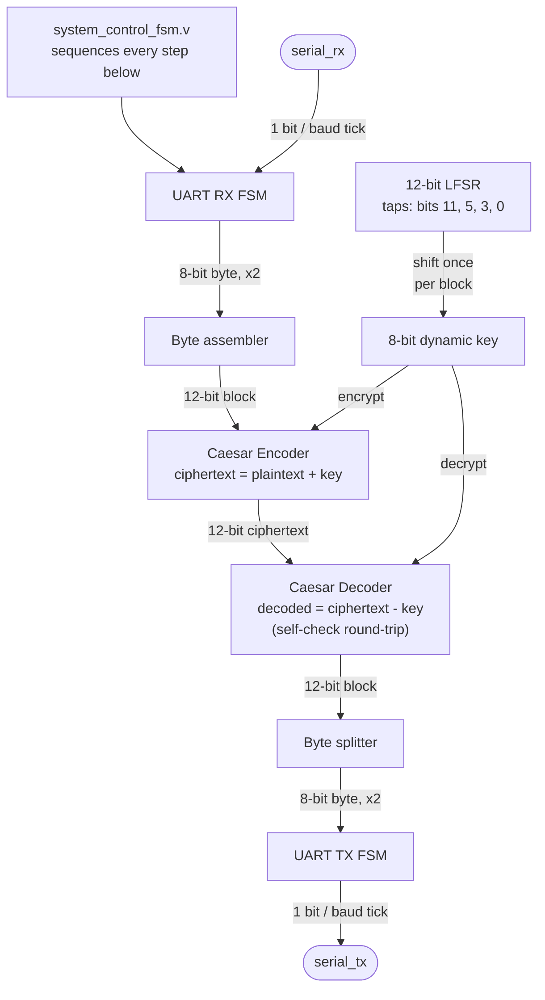

# Caesar Cipher with a 12-bit LFSR-Based Dynamic Key Generator

[](https://github.com/FURYBALA/CaesarCipher_LFSR_12Bit/actions/workflows/simulate.yml)

A Verilog HDL implementation of a Caesar cipher whose shift key is
generated dynamically by a 12-bit LFSR (rather than a fixed key), with
UART-based 8N1 serial framing so the whole encrypt/decrypt pipeline runs
over a realistic serial link instead of parallel test vectors.

Built for **21ECC311L -- VLSI Design Laboratory**, Semester V (2025-26
ODD), Department of Electronics and Communication Engineering, SRM
Institute of Science and Technology. The original project report is at
[`docs/CaesarCipher_LFSR_12Bit report.pdf`](docs/CaesarCipher_LFSR_12Bit%20report.pdf).

> **This repo reconstructs and actually verifies that report's design**
> by real simulation (Icarus Verilog), not by re-describing it. Doing so
> found and fixed four real RTL bugs -- including one that made the
> project's central "dynamic key" claim silently false while every test
> the original report ran still appeared to pass -- plus a fifth bug
> found in a piece of *verification* code while extending the test
> suite. Nothing here claims more than what was actually run and
> observed. Full evidence: [`docs/verification-log.md`](docs/verification-log.md).

## Problem statement / motivation

Classical Caesar ciphers use a single fixed shift key for an entire
message, making them trivially breakable by frequency analysis. This
project's brief was to harden that scheme in hardware by generating the
shift key dynamically from a 12-bit LFSR, and to carry the encrypted
data over a real UART serial link rather than testing it with parallel
data vectors -- closer to how such a block would actually sit in an
embedded system.

## Key features

- 12-bit maximal-length LFSR (period 4095, independently measured by
  simulation) as the dynamic key source
- Caesar cipher via modular addition/subtraction on 12-bit blocks
- Full 8N1 UART receiver and transmitter FSMs, paced by a real,
  parameterized baud-rate divider -- not a hardwired always-1 tick
- A single top-level sequencing FSM coordinating receive, key-shift,
  encrypt, decrypt, and transmit as one pipeline per 12-bit block
- Two independent testbenches: a 16-block system-level UART round-trip
  test and a standalone LFSR period/lock-up test
- A GitHub Actions workflow that compiles and simulates the design on
  every push

## Architecture



Encoder and decoder run in the *same* pipeline on one board (encrypt,
then immediately decrypt as a self-check, then transmit) -- not two
separate endpoints on either end of a link. Full mechanics -- how the
LFSR works, how the key is derived (and the real distinction between
the LFSR's 4095-state period and the 8-bit key's much shorter repeat
point), UART framing, and the exact per-block flow -- are in
[`docs/architecture.md`](docs/architecture.md).

## Technologies / tools used

**Verilog HDL** (`-g2012`) · **Icarus Verilog** v12.0
(`s20150603-1539-g2693dd32b`) for compilation/simulation · **GTKWave**
for optional waveform inspection · **GitHub Actions** (`ubuntu-latest`)
for CI · **Bash** (`sim/run.sh`) to drive everything locally.

## Repository structure

```
rtl/            baud_tick_gen, crypto_encoder/decoder_block, uart_receiver/transmitter_fsm,
                 system_control_fsm, top_system_integration
tb/              top_system_testbench.v (16-block UART round-trip), lfsr_period_test.v (standalone LFSR test)
sim/run.sh       Compile + simulate -- normal / --trace / --lfsr-test
docs/            original report PDF, architecture.md, verification-log.md, interview-questions.md
.github/workflows/simulate.yml   CI: compiles and runs both testbenches on every push/PR
```

## Quick start

Requires [Icarus Verilog](http://iverilog.icarus.com/) (`iverilog` +
`vvp`) on `PATH` -- nothing else to install or configure.

```bash
# Windows:        winget install --id=Icarus.Verilog -e
# Debian/Ubuntu:  sudo apt-get install iverilog   (also what CI uses)
# macOS:          brew install icarus-verilog

git clone https://github.com/FURYBALA/CaesarCipher_LFSR_12Bit.git
cd CaesarCipher_LFSR_12Bit

sim/run.sh             # system-level test: UART -> encrypt -> decrypt -> UART (16 blocks)
sim/run.sh --trace     # same, plus a per-cycle signal trace
sim/run.sh --lfsr-test # standalone LFSR period / lock-up test

gtkwave sim/top_system_testbench.vcd   # inspect the real waveform sim/run.sh produces
```

These are the exact `iverilog`/`vvp` invocations in
[`sim/run.sh`](sim/run.sh) -- nothing hidden or wrapped further. Both
testbenches are deterministic (no randomness anywhere in this design),
so output matches [Verification results](#verification-results) below
every time.

## Verification results

| Test | Result |
|---|---|
| 16-block UART round-trip (encrypt -> decrypt -> compare) | **PASS** -- 16/16 blocks matched |
| Dynamic-key distinctness (16 blocks) | **PASS** -- `50 a0 41 83 06 0c 18 31 63 c6 8c 19 32 65 cb 97`, all distinct |
| LFSR maximal-length | **PASS** -- period 4095 = 2^12 - 1, confirmed by simulation |
| LFSR all-zero lock-up | **PASS** -- 0 zero-state visits across the full period |
| FPGA synthesis / implementation | **Not attempted** -- no Xilinx/FPGA toolchain in this environment |
| Physical hardware testing | **Not attempted** -- simulation only, no board available |
| ModelSim / Xilinx ISE | **Not run here** -- original report's own screenshots are in the source PDF; this repo's verification is an independent Icarus Verilog run |

Full test-case table, real captured simulation output, verification
methodology, and the bug-by-bug story of everything that was actually
found and fixed: [`docs/verification-log.md`](docs/verification-log.md).

## Continuous integration

[`.github/workflows/simulate.yml`](.github/workflows/simulate.yml) runs
on every push/PR: installs Icarus Verilog via `apt-get`, compiles and
runs both testbenches, and fails the job if either testbench's own
`TESTBENCH RESULT: PASS` line is missing from its output (`vvp` itself
always exits 0 on a clean `$finish`, so CI greps for that line rather
than trusting the process exit code). Logs and the `.vcd` waveform are
uploaded as a build artifact on every run.

## Known, real limitations

- **Simulated only.** No FPGA synthesis, no ModelSim/Xilinx ISE run in
  this environment, no physical hardware.
- **Cryptographic strength is limited.** Each key is just the previous
  LFSR state shifted by one bit, so consecutive keys are strongly
  correlated -- a teaching-lab demonstration of the dynamic-key
  *concept*, not a cipher resistant to a knowledgeable attacker.
- **No framing-error recovery.** An out-of-spec UART stop bit is a
  known, undefended lockup path in the receiver, consistent with the
  original report's own stated scope.
- **No GTKWave screenshots yet.** The `.vcd` is real and regenerated
  every run; captured screenshots under `docs/` are a planned addition.

Full detail, including what this repo's verification does and doesn't
prove: [`docs/verification-log.md`](docs/verification-log.md#what-this-does-and-doesnt-prove).

## Future improvements

1. Framing-error handling (timeout/re-sync instead of an undefended
   lockup on a bad stop bit).
2. Real FPGA synthesis and hardware bring-up.
3. A less-correlated key source, since consecutive LFSR-derived keys
   are only one shift apart.
4. Configurable/negotiated baud rate instead of a compile-time
   parameter.

More detail, and why each of these actually matters here specifically:
[`docs/interview-questions.md`](docs/interview-questions.md#design-improvement).

## Resume-ready project description

- Designed and verified a 12-bit LFSR-based dynamic-key Caesar cipher in
  Verilog HDL with a full 8N1 UART transmit/receive pipeline, simulated
  end-to-end with Icarus Verilog rather than parallel test vectors.
- Found and fixed 4 real functional/timing bugs through actual
  simulation and signal-trace analysis -- including a static-key defect
  that silently broke the project's core "dynamic key" mechanism while
  every existing round-trip test still passed.
- Built a verification suite covering system-level round-trip
  correctness across 16 blocks, explicit per-block key-distinctness
  checking, and a standalone test proving the LFSR is genuinely
  maximal-length (period 4095) with no lock-up state reachable from its
  seed.
- Set up a GitHub Actions CI pipeline that compiles and simulates the
  design on every push, gating on the testbenches' own pass/fail output
  rather than process exit codes.

## Interview preparation

[`docs/interview-questions.md`](docs/interview-questions.md) -- likely
technical questions on the LFSR, the dynamic key, UART framing,
verification methodology, and synthesis/hardware next steps, each
answered with a pointer to the specific file, bug, or real simulation
result behind it.

## License

MIT -- see [LICENSE](LICENSE).

## Team

Built by a team of three for 21ECC311L at SRM Institute of Science and
Technology:

| Name | Registration No. |
|---|---|
| Agnihotram Chinmayanand | RA2311053010116 |
| Maniesh S | RA2311053010119 |
| B.V. Balanilavan | RA2311053010123 |
