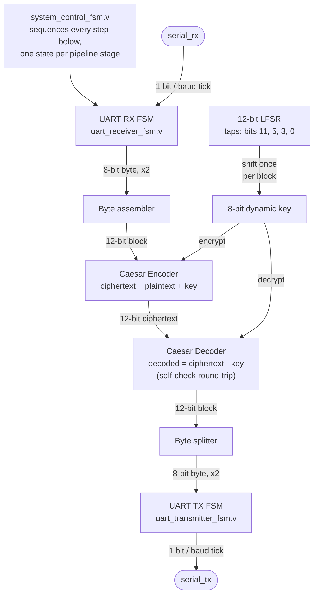

# Architecture

Full mechanics of the pipeline: how the LFSR works, how the Caesar
cipher works, how the dynamic key is generated, the UART framing, and
the exact per-block encryption/decryption flow. For headline results
and quick-start commands, see the [README](../README.md); for the full
bug-by-bug verification story, see
[`verification-log.md`](verification-log.md).

## System architecture



**Note on this diagram vs. a generic "TX board / RX board" cipher
diagram:** a typical two-endpoint cipher diagram shows encryption on one
side of a link and decryption on the other. This design's actual
architecture is different -- both the encoder and decoder live in the
*same* pipeline on one board: a received block is encrypted and then
immediately decrypted with the same key as a self-check before being
transmitted back out. That's the real, current scope (per the original
report and this reconstruction); it demonstrates the cipher and key
generator functioning correctly end-to-end, not a two-party encrypted
link. See the README's [Known, real limitations](../README.md#known-real-limitations).

Each 12-bit block is built from two received UART bytes (byte 0 = the
low 8 bits, byte 1's low nibble = the high 4 bits), encrypted, decrypted
as a self-check, then split back into two bytes and transmitted. A
fresh LFSR shift (and therefore a fresh 8-bit key) happens once per
block, paced by `system_control_fsm.v`.

## How the LFSR works

`rtl/crypto_encoder_block.v` implements a 12-bit Fibonacci LFSR with XOR
feedback taps at bit positions 11, 5, 3, and 0:

```verilog
assign lfsr_feedback_bit = lfsr_state[11] ^ lfsr_state[5] ^ lfsr_state[3] ^ lfsr_state[0];
...
lfsr_state <= {lfsr_state[10:0], lfsr_feedback_bit}; // shift left, feedback into bit 0
```

It resets to `12'h001` and is seeded once (not every block -- see
[Bug 4](verification-log.md#bug-4-the-dynamic-key-wasnt-actually-dynamic))
to `12'h0A8`. This tap set was independently verified by simulation
(`tb/lfsr_period_test.v`) to give a true maximal-length sequence: period
4095 = 2^12 - 1, visiting every nonzero 12-bit state exactly once per
cycle, and never landing on the all-zero lock-up state.

**Important distinction -- state period vs. key period.** The 4095
figure above is the period of the full 12-bit LFSR *state*. The 8-bit
*key* used by the cipher (see below) is only the low byte of that
state, so it has just 256 possible values -- by simple pigeonhole it
must repeat far sooner than 4095 shifts. `tb/lfsr_period_test.v` measures
this too, not just the state period: over one full 4095-shift cycle,
255 of the 256 possible key values appear, and the *first* repeated key
value shows up at shift 31 (key `0x0c`, first seen at shift 6). Don't
read "12-bit maximal-length period" as "the key doesn't repeat for 4095
blocks" -- it's the state that doesn't, not the key. Full measurement
detail: [verification-log.md](verification-log.md#additional-verification-is-the-lfsr-actually-maximal-length).

## How the Caesar cipher works

The cipher operates on 12-bit blocks (not 8-bit bytes) via modular
arithmetic, truncated to 12 bits by the output width:

```verilog
// crypto_encoder_block.v
ciphertext_out = plaintext_in + shift_key_reg;   // mod 4096

// crypto_decoder_block.v
plaintext_out  = ciphertext_in - shift_key_in;   // mod 4096, exact inverse
```

## How the dynamic key is generated

The 8-bit key is simply the low byte of the 12-bit LFSR state
(`lfsr_state[7:0]`), forced to `8'h01` if it would otherwise be
`8'h00`. `system_control_fsm.v`'s `S_SHIFT_KEY` state asserts
`lfsr_shift_en` once per block, so the key genuinely changes block to
block -- confirmed by an explicit distinctness check across all 16
blocks in `tb/top_system_testbench.v` (correct decryption alone cannot
prove this, since encoder/decoder are exact inverses for *any* fixed
key -- see [Bug 4](verification-log.md#bug-4-the-dynamic-key-wasnt-actually-dynamic)
for what that gap actually hid).

## UART communication flow

8N1 framing (1 start bit, 8 data bits LSB-first, 1 stop bit), paced by
`baud_tick_in` pulses from `rtl/baud_tick_gen.v` (a real
`CLK_FREQ_HZ / BAUD_RATE` clock divider -- 50 MHz / 115200 baud = a
434-cycle period by default). `uart_receiver_fsm.v` idles watching
`serial_rx`; a falling edge is interpreted as a start bit and moves the
FSM through `RX_IDLE -> RX_START -> RX_DATA -> RX_STOP -> RX_DONE`,
asserting `rx_data_ready` once a valid stop bit is sampled.
`uart_transmitter_fsm.v` mirrors this on transmit
(`TX_IDLE -> TX_START -> TX_DATA -> TX_STOP`).

## Encryption/decryption flow

1. **Reset**: LFSR loads its one-time seed (`12'h0A8`).
2. **Receive**: two UART bytes are assembled into one 12-bit block
   (`S_RX_WAIT`, `S_RX_BYTE0` in `system_control_fsm.v`).
3. **Key shift**: the LFSR shifts once, producing a fresh 8-bit key
   (`S_SHIFT_KEY`).
4. **Encrypt**: `ciphertext = plaintext + key mod 4096` (`S_ENCRYPT`).
5. **Decrypt**: `decoded = ciphertext - key mod 4096` (`S_DECRYPT`) --
   a self-check that the cipher round-trips correctly with the key that
   was actually used.
6. **Transmit**: the decoded 12-bit block is split back into two bytes
   and sent out over UART (`S_TX_START`, `S_TX_WAIT`, `S_TX_WAIT_FINAL`).
7. Back to **Idle**, ready for the next block -- the LFSR is *not*
   reseeded here (that was Bug 4; see the verification log).

## What's actually in this repo vs. the original report

The original report's appendix had two things that wouldn't reproduce
as-is:
- A hardwired `baud_tick = 1'b1` (no real baud-rate divider), despite
  the report's own text claiming baud-rate accuracy was verified
- A `system_control_fsm.v` transcription with mismatched `begin`/`end`
  blocks that wouldn't compile

Both are fixed here, along with two further bugs found only by actually
simulating the corrected design end-to-end -- a receiver handshake
race, and the static-key bug mentioned above. A fifth issue -- this
time in a testbench rather than the RTL -- was found while extending
verification coverage for this documentation. See
[`verification-log.md`](verification-log.md) for the full, specific
story of each, including the real simulation output that found and then
confirmed the fix for each one.

One further, minor discrepancy worth naming explicitly: the report's
"Functional Modules Explanation" describes the encoder as "performing
modulo 256 arithmetic for ASCII compatibility," but the actual
implementation (both in the report's own appendix and in this repo)
operates on 12-bit blocks -- i.e. modulo 4096, not modulo 256. The code
was taken as authoritative here, not the prose summary.
